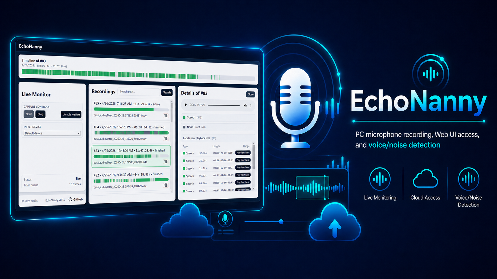

<p align="center">
  
</p>

<h1 align="center">EchoNanny</h1>

<p align="center">
  <a href="https://pypi.org/project/echonanny/"></a>
  
  <a href="https://github.com/s0d3s/EchoNanny/blob/main/LICENSE"></a>
  <a href="https://github.com/s0d3s/EchoNanny/releases"></a>
  <a href="https://github.com/s0d3s/EchoNanny/actions/workflows/ci-build-linux.yml"></a>
  <a href="https://github.com/s0d3s/EchoNanny/actions/workflows/release-artifacts.yml"></a>
</p>

EchoNanny provides remote access to your PC microphone stream with a clean Web UI, recording history, and automatic audio labeling.

> [!NOTE]
> On Windows also possible to record audio from speakers(system audio)

## Features

- **Live monitoring** over a WebSocket audio stream
- **Recording history** with timeline and playback tools
- **Automatic labels** for speech and loud-noise events. You can easily find parts of audio with voices or another noise!
- **Web UI access** to PC audio from anywhere\*
- **Low CPU-usage**, so can be easily run in background
- **Auto-cut recording policy** that automatically stops recording after `{M}` minutes if no voice activity is detected during the last `{N}` minutes:
  - `AUTO_CUT_MIN_RECORDING_MINUTES={M}`
  - `AUTO_CUT_INACTIVE_WINDOW_MINUTES={N}`
- **Cross-platform distribution options**: wheel, PyInstaller, and Inno Setup for Windows

> \* If you are using your own PC behind NAT, a private network, or a similar setup, you will need to use a tunneling app such as `zrok` or `Cloudflare Tunnel`, or configure port forwarding if your Wi-Fi router supports it.

## Installation

**Prerequisites**:

- Python **3.11+** in PATH
- Only for Linux+(**Install script** OR **Wheel** Installation): PortAudio runtime/dev packages may be required for `pyaudio`:
  ```bash
  apt-get install -y --no-install-recommends build-essential portaudio19-dev
  ```

### 📀 Installation Options (choose only one)

1) **PyInstaller executable**(Portable Program packed in archive)

    Download the prebuilt PyInstaller artifact from [Releases](https://github.com/s0d3s/EchoNanny/releases), unpack it, and run `echonanny` executable.

2) **Install script**

Use the standalone installer script:

- **Linux / macOS (Bash)**

  ```bash
  curl -fsSL https://raw.githubusercontent.com/s0d3s/EchoNanny/main/scripts/install.sh | bash
  ```

- **Windows (PowerShell)**

  ```powershell
  irm https://raw.githubusercontent.com/s0d3s/EchoNanny/main/scripts/install.ps1 | iex
  ```

The installer script will:
- Check prerequisites (`python` + `venv`; and on Linux, PortAudio dev presence)
- Ask for install destination directory (must exist and be empty)
- Create and activate virtual environment
- Install `echonanny` from PyPI
- Create `.env` via `echonanny init-env`
- Print colored next steps for credentials, server start, and Web UI access

3) **Python wheel** (global/virtual env)

    Install a wheel from [PyPI](https://pypi.org/project/echonanny/) or from GitHub Release assets:

    ```bash
    python -m pip install echonanny
    ```
    **Setup**:
    - Create data folder for application and `cd` to it(in that folder will be saved Recording Audio files and `.env` configuration file)
    - Run: `echonanny init-env` to create default `.env` file
    - Modify `.env`(if needed) as in a section below
    - Run app from this dir via command: `echonanny serve`


4) Inno Setup installer (Windows only)

    Download `EchoNanny-Setup*.exe` from [Releases](https://github.com/s0d3s/EchoNanny/releases), run installer, then launch EchoNanny from Start Menu.

> [!NOTE]
> Read info about configuring and accessing Web UI below👇

## 🌐 Web UI

- Run the app as described in your chosen installation method
- From the same PC, open: `http://127.0.0.1:8000` (or the address printed in the app console)
- Use credentials written in `.env` file(CHANGE THEM on first startup):
  - `INSTANCE_USER_EMAIL`
  - `INSTANCE_USER_PASSWORD`

## `.env` Configuration Tips

EchoNanny uses instance credentials and runtime options from `.env`.

To edit it, open this file in any text editor and modify the required lines.

### Where to place `.env`

- **PyInstaller / Inno install**: use generated config under user-local EchoNanny folder (created via `init-env`)
- **Wheel/manual**: keep `.env` in your run directory, or pass explicit file path to CLI(`echonanny serve --env-file ./config.env`)

## CLI Interface

After installation, `echonanny` command is available:

```bash
echonanny init-env
echonanny serve --env-file ./config.env
```

- `init-env` — creates `.env` from packaged template if missing
- `serve` — starts backend server with selected env configuration

## Release Artifacts

Each GitHub Release can include:

- PyInstaller build for **Windows / Linux / macOS**
- Inno Setup installer for **Windows**
- Universal Python wheel (`py3-none-any`)
